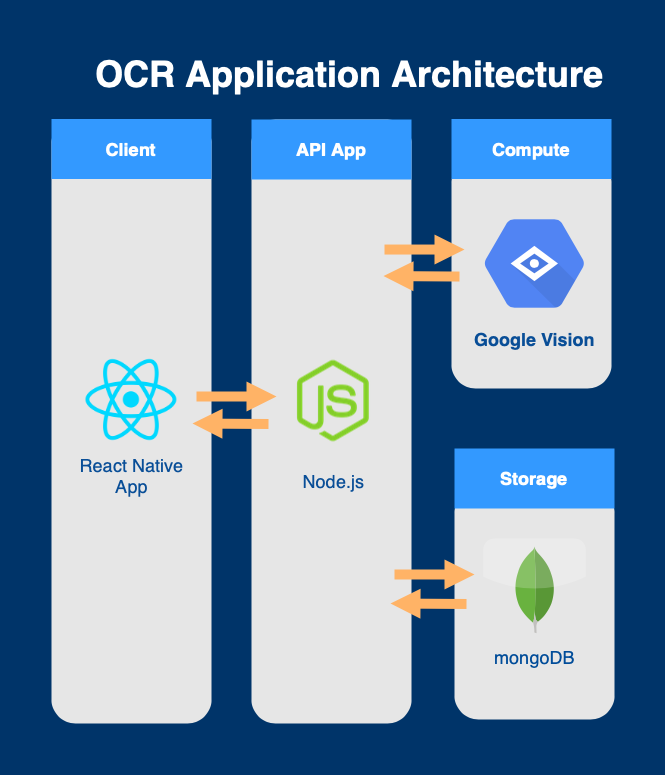

# OCR Server Application

It is a OCR server application, have to work with the [client](https://github.com/ericc0504/OCR-React-Native).

## System Architecture

## Supporting Requests

- `POST /processImg`
  > Receive image as base64 string, send it to Google Vision API and get OCR Result, store the result to database and return it to client.
- `GET /previousOcrResult`
  > Return all history to cleint
- `GET /fullSizeImg`
  > Return full size image of previous result

## Requirements

- `node`: 12.18.2

## Build

- Run `npm install`
- Run `npm start`
